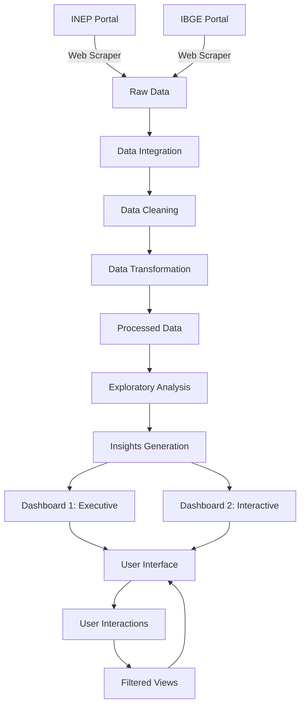
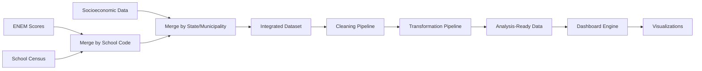

# ENEM Dashboard Project - Comprehensive Analysis Plan

## Project Overview
Interactive dashboard providing comprehensive analysis of ENEM performance across multiple dimensions: regional/geographic, socioeconomic, demographic, temporal trends, and school infrastructure factors.

**Goal**: Create two Dash dashboards that deliver deep insights into Brazilian educational performance through multi-dimensional analysis.

---

## 1. Project Structure

```
Dashboard/
├── data/
│   ├── raw/              # Raw data from scraper
│   ├── processed/        # Cleaned and transformed data
│   └── README.md         # Data documentation
├── src/
│   ├── scraper/
│   │   ├── __init__.py
│   │   ├── inep_scraper.py      # Web scraper for INEP data
│   │   └── config.py             # Scraper configuration
│   ├── data_processing/
│   │   ├── __init__.py
│   │   ├── data_loader.py        # Load raw data
│   │   ├── data_cleaner.py       # Clean and treat data
│   │   ├── data_transformer.py   # Transform and create features
│   │   └── data_integrator.py    # Merge and concatenate datasets
│   ├── analysis/
│   │   ├── __init__.py
│   │   └── exploratory_analysis.py  # EDA and insights generation
│   ├── dashboards/
│   │   ├── __init__.py
│   │   ├── dashboard_1_executive.py  # Executive overview dashboard
│   │   ├── dashboard_2_interactive.py # Interactive exploration dashboard
│   │   └── components.py             # Reusable dashboard components
│   └── utils/
│       ├── __init__.py
│       └── visualization_helpers.py  # Chart styling and helpers
├── assets/
│   ├── styles.css        # Custom CSS for dashboards
│   └── logo.png          # Optional branding
├── docs/
│   └── presentation.pptx # Project presentation
├── notebooks/
│   └── exploratory_analysis.ipynb  # Jupyter notebook for EDA
├── app.py                # Main application entry point
├── requirements.txt      # Python dependencies
├── README.md            # Project documentation
└── .gitignore           # Git ignore file
```

---

## 2. Data Collection Strategy (Web Scraper - Bonus)

### Target Data Sources:
1. **INEP Microdados ENEM** (https://www.gov.br/inep/pt-br/acesso-a-informacao/dados-abertos/microdados)
   - ENEM scores by subject (Mathematics, Languages, Natural Sciences, Human Sciences, Essay)
   - Student demographic information (age, gender, race/ethnicity)
   - Socioeconomic questionnaire responses
   - School identification and characteristics

2. **INEP School Census Data**
   - School infrastructure (library, lab, internet, etc.)
   - Number of teachers and qualifications
   - School location (urban/rural)
   - Administrative dependency (federal, state, municipal, private)

3. **IBGE Socioeconomic Data**
   - Income per capita by state/municipality
   - Education level of population
   - HDI indicators
   - Employment statistics

### Scraper Features:
- Automated download of CSV/ZIP files from INEP portal
- Multi-year data collection capability
- Data extraction and initial validation
- Error handling and retry logic
- Progress tracking and logging
- Configurable data range selection

---

## 3. Data Pipeline

### 3.1 Data Acquisition
- Scraper downloads at least 2-3 datasets:
  1. ENEM individual scores (multiple years if possible)
  2. School census data
  3. Socioeconomic indicators
- Ensure minimum 10,000 records per dataset
- Store in `data/raw/` directory with clear naming convention

### 3.2 Data Integration
**Operations:**
- **Concatenation**: Combine multiple years of ENEM data vertically
- **Merge Operations**:
  - Join ENEM data with school census by school code
  - Join with socioeconomic data by state/municipality code
  - Join demographic data by relevant identifiers

**Key columns for merging:**
- School code (CO_ESCOLA)
- State code (SG_UF_RESIDENCIA)
- Municipality code (CO_MUNICIPIO_RESIDENCIA)
- Year (NU_ANO)

### 3.3 Data Cleaning
**Tasks:**
- Handle missing values:
  - Imputation for numerical variables (mean/median)
  - Mode imputation for categorical variables
  - Remove records with critical missing data
- Remove duplicate records
- Fix data type inconsistencies
- Standardize categorical values (e.g., state names, school types)
- Remove outliers or invalid entries
- Validate data ranges:
  - ENEM scores: 0-1000 per subject
  - Age: reasonable student age range
  - Socioeconomic indicators: valid ranges
- Handle encoding issues (UTF-8 standardization)

### 3.4 Data Transformation
**New Variables to Create:**

**Performance Metrics:**
- Average ENEM score (overall and by subject)
- Performance categories (low, medium, high, excellent)
- Normalized scores for comparison
- Performance gap metrics
- Subject-specific performance indices

**Geographic Variables:**
- Regional groupings (North, Northeast, Southeast, South, Center-West)
- Urban vs Rural classification
- State-level aggregations
- Municipality-level aggregations

**Socioeconomic Variables:**
- Composite socioeconomic index
- Income quintiles
- Parental education level categories
- Family structure indicators
- Access to resources index (internet, books, etc.)

**Demographic Variables:**
- Age groups
- Gender distribution
- Race/ethnicity categories
- First-generation college student indicator

**School-Related Variables:**
- School infrastructure index
- Teacher qualification index
- School size categories
- Public vs Private classification
- School performance ranking

**Temporal Variables:**
- Year-over-year growth rates
- Trend indicators
- Cohort comparisons

**Aggregations:**
- State-level statistics (mean, median, std, min, max)
- Regional statistics
- School-type statistics
- Demographic group statistics
- Time-series aggregations

---

## 4. Comprehensive Exploratory Data Analysis

### Analysis Dimensions:

#### 4.1 Geographic Analysis
**Questions:**
- Which states/regions have the highest and lowest ENEM performance?
- How does urban vs rural location affect performance?
- Are there geographic clusters of high/low performance?
- What is the performance distribution across municipalities?

**Expected Insights:**
- Regional disparities in educational outcomes
- Urban-rural performance gaps
- Identification of high-performing regions despite challenges
- Geographic patterns in subject-specific performance

#### 4.2 Socioeconomic Analysis
**Questions:**
- How does family income correlate with ENEM scores?
- What is the impact of parental education on student performance?
- How do access to resources (internet, books) affect outcomes?
- What is the performance gap between income quintiles?

**Expected Insights:**
- Strong correlation between socioeconomic status and performance
- Impact of educational resources on outcomes
- Identification of students who overcome socioeconomic barriers
- Critical socioeconomic factors for success

#### 4.3 Demographic Analysis
**Questions:**
- How does performance vary by gender?
- Are there performance differences across racial/ethnic groups?
- How does age affect ENEM scores?
- What patterns exist for first-generation college students?

**Expected Insights:**
- Gender gaps in specific subjects (e.g., math vs languages)
- Racial/ethnic disparities in educational outcomes
- Age-related performance patterns
- Challenges faced by first-generation students

#### 4.4 School Infrastructure Analysis
**Questions:**
- How does school infrastructure correlate with performance?
- What is the impact of teacher qualifications?
- How do public vs private schools compare?
- Which infrastructure elements matter most?

**Expected Insights:**
- Critical infrastructure factors for student success
- Teacher quality impact on outcomes
- Public-private performance gaps
- Cost-effective infrastructure improvements

#### 4.5 Temporal Trends Analysis
**Questions:**
- How has national performance changed over time?
- Which states show improvement or decline?
- Are performance gaps widening or narrowing?
- What trends exist in specific subjects?

**Expected Insights:**
- National education trends
- States with improving/declining performance
- Evolution of equity in education
- Subject-specific trends

#### 4.6 Multi-Dimensional Interactions
**Questions:**
- How do multiple factors interact (e.g., income + school type)?
- Which combinations of factors predict high performance?
- Are there unexpected patterns when combining dimensions?
- What are the most influential factor combinations?

**Expected Insights:**
- Complex interactions between variables
- High-leverage intervention points
- Surprising positive outliers
- Compounding effects of multiple disadvantages

---

## 5. Dashboard Design

### Dashboard 1: Executive Overview
**Purpose**: Comprehensive snapshot of key metrics across all analysis dimensions

**Layout Structure:**
```
┌─────────────────────────────────────────────────────────┐
│                    HEADER / TITLE                        │
├──────────┬──────────┬──────────┬──────────┬─────────────┤
│  KPI 1   │  KPI 2   │  KPI 3   │  KPI 4   │   KPI 5     │
│ Avg Score│ Students │ Perf Gap │ Socio    │ School      │
│          │ Analyzed │          │ Corr     │ Impact      │
├──────────┴──────────┴──────────┴──────────┴─────────────┤
│                                                           │
│  Main Visualization: Brazil Map (Choropleth)             │
│  ENEM Performance by State                               │
│                                                           │
├───────────────────────────┬───────────────────────────────┤
│                           │                               │
│  Top/Bottom States        │  Performance by Region        │
│  (Bar Chart)              │  (Radar Chart)                │
│                           │                               │
├───────────────────────────┼───────────────────────────────┤
│                           │                               │
│  Socioeconomic Impact     │  Temporal Trend               │
│  (Scatter + Regression)   │  (Line Chart)                 │
│                           │                               │
└───────────────────────────┴───────────────────────────────┘
```

**Components:**

1. **KPI Cards** (5 metrics):
   - National average ENEM score
   - Total students analyzed
   - Performance gap (highest vs lowest state)
   - Socioeconomic correlation coefficient
   - School infrastructure impact score

2. **Main Visualizations**:
   - **Choropleth Map**: ENEM performance by state (color-coded)
   - **Bar Chart**: Top 10 and bottom 10 states
   - **Radar Chart**: Regional comparison across 5 subjects
   - **Scatter Plot**: Socioeconomic index vs ENEM score with regression line
   - **Line Chart**: National average trend over years

**Design Principles:**
- Clean, professional layout
- Limited color palette (2-3 main colors + gradients)
- Large, readable fonts
- Clear titles and annotations
- Minimal text, maximum visual impact

---

### Dashboard 2: Interactive Exploration
**Purpose**: Deep dive multi-dimensional analysis with user-driven exploration

**Layout Structure:**
```
┌─────────────────────────────────────────────────────────┐
│                    HEADER / TITLE                        │
├─────────────────────────────────────────────────────────┤
│  FILTERS PANEL                                           │
│  [State] [Region] [Year] [School Type] [Income Level]   │
│  [Gender] [Age Group] [Reset]                           │
├───────────────────────────┬───────────────────────────────┤
│                           │                               │
│  Distribution Analysis    │  Correlation Heatmap          │
│  (Box Plot by Region)     │  (All Variables)              │
│                           │                               │
├───────────────────────────┼───────────────────────────────┤
│                           │                               │
│  Performance Trends       │  Demographic Comparison       │
│  (Multi-line Chart)       │  (Grouped Bar Chart)          │
│                           │                               │
├───────────────────────────┼───────────────────────────────┤
│                           │                               │
│  Socioeconomic Impact     │  School Infrastructure        │
│  (Violin Plot)            │  (Scatter Matrix)             │
│                           │                               │
├───────────────────────────┴───────────────────────────────┤
│                                                           │
│  Subject Performance Breakdown (Stacked Area Chart)       │
│                                                           │
└───────────────────────────────────────────────────────────┘
```

**Required Elements:**
- **Minimum 7 visualizations** (exceeding requirement)
- **Minimum 5 interactive filters** (exceeding requirement)

**Filters (Interactive Controls):**
1. **State/Region Selector**: Multi-select dropdown
2. **Year Range**: Slider for temporal filtering
3. **School Type**: Checkbox group (Public Federal, State, Municipal, Private)
4. **Socioeconomic Level**: Range slider (quintiles)
5. **Gender**: Radio buttons or multi-select
6. **Age Group**: Dropdown
7. **Infrastructure Level**: Range slider

**Visualizations:**

1. **Box Plot**: Score distribution by region
   - Shows median, quartiles, outliers
   - Filterable by all dimensions

2. **Correlation Heatmap**: All variables correlation matrix
   - Interactive hover for exact values
   - Color-coded by correlation strength

3. **Multi-line Chart**: Performance trends over time
   - Separate lines for different groups
   - Filterable by demographics

4. **Grouped Bar Chart**: Demographic comparison
   - Gender, race/ethnicity performance
   - Side-by-side comparison

5. **Violin Plot**: Score distribution by income quintile
   - Shows full distribution shape
   - Highlights socioeconomic impact

6. **Scatter Matrix**: School infrastructure variables
   - Multiple scatter plots in grid
   - Shows relationships between infrastructure factors

7. **Stacked Area Chart**: Subject performance breakdown
   - Shows contribution of each subject
   - Temporal evolution

8. **Sunburst Chart** (bonus): Hierarchical performance view
   - Region → State → School Type
   - Interactive drill-down

**Interactive Features:**
- Click on map/chart to filter other visualizations
- Hover tooltips with detailed information
- Dynamic updates based on filter selections
- Cross-filtering between charts
- Download filtered data button
- Reset all filters button
- Export chart as image
- Data table view toggle

---

## 6. Visual Communication Best Practices

### Color Scheme:
**Primary Palette:**
- Primary: Blue (#1f77b4) - trust, education, stability
- Secondary: Orange (#ff7f0e) - highlights, attention
- Success: Green (#2ca02c) - positive trends, growth
- Alert: Red (#d62728) - areas of concern, gaps
- Neutral: Gray (#7f7f7f) - supporting elements

**Gradient Scales:**
- Performance: Red (low) → Yellow (medium) → Green (high)
- Socioeconomic: Light blue → Dark blue
- Diverging: Red ← White → Blue (for correlations)

### Typography:
- **Headers**: Bold, 20-26px, dark color
- **Subheaders**: Semi-bold, 16-18px
- **Body text**: Regular, 12-14px
- **Labels**: 10-12px
- **Font family**: Arial, Helvetica, or Roboto (web-safe)

### Layout Principles:
- **Grid-based layout**: 12-column grid for alignment
- **White space**: Adequate padding and margins
- **Visual hierarchy**: Size and color to guide attention
- **Responsive design**: Adapt to different screen sizes
- **Section separators**: Clear visual breaks
- **Consistent spacing**: Uniform gaps between elements

### Chart Guidelines:
- **Axis labels**: Always present and descriptive
- **Titles**: Clear, specific, action-oriented
- **Legends**: Positioned logically, easy to read
- **Annotations**: Highlight key insights directly on charts
- **Consistent styling**: Same colors/fonts across all charts
- **Data-ink ratio**: Minimize non-data elements
- **Accessibility**: Consider color-blind friendly palettes

### Storytelling Elements:
- **Context**: Provide background for each visualization
- **Insight callouts**: Text boxes highlighting key findings
- **Comparisons**: Show benchmarks and reference points
- **Trends**: Indicate direction and magnitude of change
- **Actionability**: Suggest implications of findings

---

## 7. Technical Implementation

### Technology Stack:
- **Python 3.8+**
- **Dash & Plotly**: Dashboard framework and visualizations
- **Pandas**: Data manipulation and analysis
- **NumPy**: Numerical operations
- **Requests & BeautifulSoup4**: Web scraping
- **Scikit-learn**: Data preprocessing, scaling, analysis
- **Jupyter**: Exploratory analysis and prototyping
- **Plotly Express**: Quick visualizations

### Key Dependencies:
```
dash>=2.14.0
dash-bootstrap-components>=1.5.0
plotly>=5.17.0
pandas>=2.1.0
numpy>=1.24.0
requests>=2.31.0
beautifulsoup4>=4.12.0
lxml>=4.9.0
openpyxl>=3.1.0
scikit-learn>=1.3.0
scipy>=1.11.0
jupyter>=1.0.0
seaborn>=0.12.0
```

### Code Organization:
- **Modular design**: Separate concerns into modules
- **Reusable components**: DRY principle
- **Configuration files**: Centralized settings
- **Error handling**: Robust exception management
- **Logging**: Track operations and errors
- **Documentation**: Docstrings and comments
- **Version control**: Git with meaningful commits

---

## 8. Comprehensive Insights Framework

### Insight Categories:

#### Geographic Insights:
- Regional performance disparities
- Urban-rural gaps
- State-level trends
- Municipal patterns

#### Socioeconomic Insights:
- Income-performance correlation
- Parental education impact
- Resource access effects
- Equity gaps

#### Demographic Insights:
- Gender performance patterns
- Racial/ethnic disparities
- Age-related trends
- First-generation challenges

#### School Infrastructure Insights:
- Critical infrastructure factors
- Teacher quality impact
- Public-private comparisons
- Cost-effective improvements

#### Temporal Insights:
- National trends
- State-level changes
- Subject-specific evolution
- Equity progress

#### Multi-Dimensional Insights:
- Factor interactions
- Compounding effects
- Positive outliers
- High-leverage interventions

### Insight Presentation:
Each insight should include:
1. **Finding**: What was discovered
2. **Evidence**: Data supporting the finding
3. **Context**: Why it matters
4. **Implication**: What it means for policy/practice
5. **Visualization**: Chart showing the pattern

---

## 9. Deliverables Checklist

### Code & Data:
- [ ] GitHub repository with complete code
- [ ] Raw data files (or scraper to obtain them)
- [ ] Processed data files
- [ ] README with setup instructions
- [ ] Requirements.txt with all dependencies
- [ ] .gitignore file
- [ ] Data dictionary/documentation

### Documentation:
- [ ] Presentation slides (PowerPoint/PDF)
- [ ] Data source documentation
- [ ] Pipeline explanation with diagrams
- [ ] Comprehensive insights summary
- [ ] Dashboard screenshots
- [ ] User guide for dashboards

### Presentation Content (20 minutes):
1. **Introduction** (2 min)
   - Project objective
   - Data sources overview
   - Analysis scope

2. **Data Pipeline** (6 min)
   - Acquisition method (scraper demonstration)
   - Integration approach (merge + concatenation)
   - Cleaning and transformation steps
   - Data quality metrics

3. **Key Insights** (10 min)
   - Geographic findings
   - Socioeconomic patterns
   - Demographic insights
   - School infrastructure impact
   - Temporal trends
   - Multi-dimensional interactions
   - Dashboard demonstrations (both dashboards)

4. **Conclusion** (2 min)
   - Summary of main findings
   - Limitations and caveats
   - Future work and recommendations

---

## 10. Evaluation Criteria Alignment

### Project Quality (50%):
- ✓ Complete data pipeline implementation
- ✓ Proper data integration (merge + concatenation)
- ✓ Thorough cleaning and transformation
- ✓ Two distinct, functional dashboards
- ✓ Comprehensive multi-dimensional insights
- ✓ Technical quality and code organization
- ✓ Exceeds minimum requirements (7+ visualizations, 5+ filters)

### Presentation (30%):
- ✓ Clear communication of methodology
- ✓ Effective demonstration of both dashboards
- ✓ Well-explained comprehensive insights
- ✓ Professional presentation materials
- ✓ Time management (20 minutes)
- ✓ Team coordination

### Peer Evaluation (20%):
- ✓ Active participation in both presentation days
- ✓ Thoughtful evaluation of other projects
- ✓ Constructive feedback and analysis
- ✓ Critical thinking demonstrated

### Bonus (+1 point):
- ✓ Functional web scraper for automated data collection

---

## 11. Implementation Timeline

### Phase 1: Setup & Data Collection (Days 1-3)
- Set up project structure and environment
- Develop and test web scraper
- Collect raw data from multiple sources
- Validate data completeness (10,000+ records)

### Phase 2: Data Processing (Days 4-7)
- Integrate datasets using merge and concatenation
- Clean and treat data systematically
- Transform data and create new variables
- Document data pipeline

### Phase 3: Exploratory Analysis (Days 8-10)
- Perform comprehensive EDA across all dimensions
- Identify patterns and insights
- Create analysis notebook
- Document findings

### Phase 4: Dashboard Development (Days 11-16)
- Build Dashboard 1 (Executive Overview)
- Build Dashboard 2 (Interactive Exploration)
- Apply visual design principles
- Implement interactivity and filters
- Test functionality

### Phase 5: Refinement & Documentation (Days 17-20)
- Debug and optimize dashboards
- Create presentation materials
- Prepare GitHub repository
- Write documentation
- Practice presentation

### Phase 6: Final Preparation (Days 21-22)
- Final testing
- Presentation rehearsal
- Prepare for Q&A
- Review evaluation criteria

---

## 12. Risk Mitigation

### Potential Challenges & Solutions:

1. **Data Availability**
   - *Risk*: INEP data might be very large or complex
   - *Solution*: Start with sample data, scale gradually; use data sampling techniques

2. **Scraper Issues**
   - *Risk*: Website structure changes or access restrictions
   - *Solution*: Have backup manual download option; implement robust error handling

3. **Performance Issues**
   - *Risk*: Large datasets slow down dashboard
   - *Solution*: Pre-aggregate data; use efficient data structures; implement caching

4. **Time Constraints**
   - *Risk*: Complex analysis takes longer than expected
   - *Solution*: Prioritize core requirements; use agile approach; parallel work streams

5. **Integration Complexity**
   - *Risk*: Difficulty merging datasets with different structures
   - *Solution*: Thorough data exploration first; create clear integration plan; test incrementally

6. **Insight Generation**
   - *Risk*: Difficulty finding meaningful patterns
   - *Solution*: Use systematic EDA approach; consult domain knowledge; iterate analysis

---

## 13. Success Metrics

### Technical Success:
- ✓ Scraper successfully collects 10,000+ records from 2+ sources
- ✓ Data pipeline runs without errors
- ✓ Both dashboards load in <3 seconds
- ✓ All interactive features work correctly
- ✓ Code is well-organized and documented

### Analysis Success:
- ✓ At least 10 meaningful insights identified across dimensions
- ✓ Clear patterns demonstrated in each analysis dimension
- ✓ Insights are actionable and well-explained
- ✓ Visualizations effectively communicate findings
- ✓ Multi-dimensional interactions explored

### Presentation Success:
- ✓ Presentation stays within 20-minute limit
- ✓ All team members participate effectively
- ✓ Dashboards demonstrate smoothly
- ✓ Questions answered confidently
- ✓ Insights clearly communicated

### Quality Indicators:
- ✓ Code follows best practices
- ✓ Documentation is comprehensive
- ✓ Dashboards are intuitive and user-friendly
- ✓ Visual design is professional
- ✓ Analysis is rigorous and thorough

---

## 14. Architecture Diagram



---

## 15. Data Flow Diagram



---

## Next Steps

This comprehensive plan covers all aspects of your ENEM dashboard project with multi-dimensional analysis. The plan includes:

✅ Complete project structure
✅ Web scraper for bonus points
✅ Comprehensive data pipeline
✅ Multi-dimensional analysis framework
✅ Two distinct dashboards with rich interactivity
✅ Professional visual design guidelines
✅ Detailed implementation timeline
✅ Risk mitigation strategies

**Are you ready to proceed with implementation?**

Once you approve this plan, I'll switch to **Code mode** to begin building:
1. Project structure setup
2. Web scraper development
3. Data processing pipeline
4. Dashboard implementation

Please confirm if you'd like to proceed or if you have any questions or modifications to the plan.